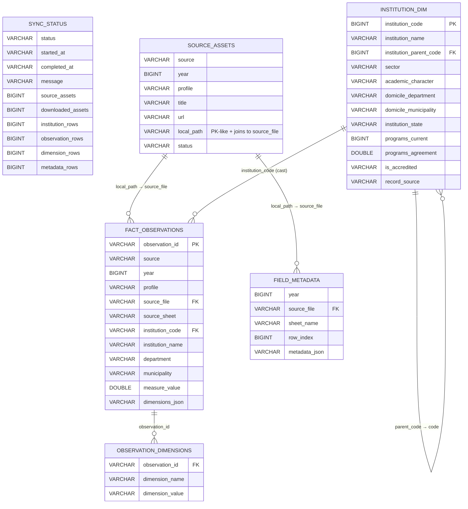

# PRIG SNIES Warehouse — Entity-Relationship Model

DuckDB file: [data/warehouse/snies.duckdb](../data/warehouse/snies.duckdb)
Source code of record:
[backend/app/pipeline/sync.py](../backend/app/pipeline/sync.py),
[backend/app/db/warehouse.py](../backend/app/db/warehouse.py),
[backend/app/services/normalization.py](../backend/app/services/normalization.py)

The warehouse is intentionally **flat and append-overwrite** — every `run_sync()` fully rebuilds every table via `warehouse.replace_table(...)`. There are no declared foreign keys in DuckDB, but there are logical keys and cross-table joins the API relies on. This document makes those relationships explicit.

## 1. Entities at a glance

```
                ┌────────────────────┐
                │    sync_status     │  singleton (1 row)
                └────────────────────┘
                           │ (operational log only, not joined)
                           ▼
┌─────────────────────┐    ▼    ┌────────────────────────────┐
│   source_assets     │────────▶│      field_metadata        │
│   (21 rows)         │  source_│      (802 rows)            │
│  PK: (source,year,  │  _file  │  from metadatos.xlsx       │
│       profile)      │         │  sheets only               │
└─────────────────────┘         └────────────────────────────┘
         │
         │ each downloaded, non-metadatos asset
         │ produces N fact_observations
         ▼
┌──────────────────────────────┐       ┌────────────────────────────────┐
│      fact_observations       │1────N │    observation_dimensions      │
│      (383,191 rows)          │──────▶│      (8,206,275 rows)          │
│  PK: observation_id          │       │  PK: (observation_id,          │
│  measure_value per profile   │       │       dimension_name)          │
└──────────────────────────────┘       └────────────────────────────────┘
         │
         │ institution_code  (string, nullable)
         │  ═══════════════▶  institution_dim.institution_code
         │                     (BIGINT — see Gotcha #1)
         ▼
┌──────────────────────────────┐
│      institution_dim         │
│      (390 rows)              │
│  PK: institution_code        │
│  sourced from HECAA CSV      │
└──────────────────────────────┘
```

## 2. Table-by-table

### 2.1 `sync_status`
**Purpose:** Single-row operational log for the last `run_sync()` execution. Replaced on every sync attempt (start / complete / fail).

| Column | Type | Notes |
|---|---|---|
| `status` | `VARCHAR` | `running` \| `completed` \| `failed` \| `not_started` |
| `started_at` | `VARCHAR` (ISO-8601 UTC) | |
| `completed_at` | `VARCHAR` (ISO-8601 UTC) | null while running |
| `message` | `VARCHAR` | human-readable outcome / exception string |
| `source_assets` | `BIGINT` | count of `SourceAsset` rows discovered |
| `downloaded_assets` | `BIGINT` | of those, the number physically downloaded |
| `institution_rows` | `BIGINT` | `len(institution_dim)` after rebuild |
| `observation_rows` | `BIGINT` | `len(fact_observations)` |
| `dimension_rows` | `BIGINT` | `len(observation_dimensions)` |
| `metadata_rows` | `BIGINT` | `len(field_metadata)` |

Surfaced via `GET /api/v1/sync-status` and displayed in the dashboard's empty-state branch.

### 2.2 `source_assets`
**Purpose:** Catalogue of files discovered on the SNIES publications page, one row per `(year × profile)` combination the scraper looks for. Includes rows for assets that were **not found on the remote** (status=`missing`, url=null) — this is how the UI can tell which years × profiles the source never published.

| Column | Type | Semantics |
|---|---|---|
| `source` | `VARCHAR` | `snies` — reserved for future multi-source expansion |
| `year` | `BIGINT` | 2022 \| 2023 \| 2024 (from `Settings.target_years`) |
| `profile` | `VARCHAR` | one of `DatasetProfile`: `inscritos`, `admitidos`, `matriculados`, `matriculados_primer_curso`, `graduados`, `docentes`, `metadatos` |
| `title` | `VARCHAR` | expected anchor text from the SNIES page (e.g. `Estudiantes Matriculados 2024`) |
| `url` | `VARCHAR` | resolved download URL, or null when no anchor matched |
| `local_path` | `VARCHAR` | absolute path inside the container (`/app/data/landing/snies/<year>/<year>_<profile>.xlsx`), or null if download failed/missing |
| `status` | `VARCHAR` | `downloaded` \| `failed` \| `missing` |

**Logical key:** `(source, year, profile)`.

**Links out:**
- `local_path` → `fact_observations.source_file` and `field_metadata.source_file` (string equality; matching paths identify which rows came from which asset).
- No FK is declared — joins are string-typed and the path is container-absolute; host tooling must account for that.

### 2.3 `institution_dim`
**Purpose:** Canonical attributes of each Institución de Educación Superior (IES). Sourced from a separate HECAA CSV (`data/raw/hecaa/institutions.csv`), not from the SNIES spreadsheets.

| Column | Type | Notes |
|---|---|---|
| `institution_code` | `BIGINT` | **logical primary key**. The HECAA "código IES" |
| `institution_name` | `VARCHAR` | |
| `institution_parent_code` | `BIGINT` | self-reference: principal IES of a seccional (null for principals). Not enforced, not always populated |
| `sector` | `VARCHAR` | `OFICIAL` / `PRIVADA` |
| `academic_character` | `VARCHAR` | `Universidad`, `Institución Universitaria`, etc. |
| `domicile_department` | `VARCHAR` | parsed from `DEPARTAMENTO / MUNICIPIO` — always `Bogotá, D.C.` for rows that survive scope filtering |
| `domicile_municipality` | `VARCHAR` | |
| `institution_state` | `VARCHAR` | `Activa`, `Inactiva`, … |
| `programs_current` | `BIGINT` | |
| `programs_agreement` | `DOUBLE` | nullable — read as float because of NaN in CSV |
| `is_accredited` | `VARCHAR` | `SI` / `NO` |
| `record_source` | `VARCHAR` | constant `hecaa` — provenance marker |

**Self-link:** `institution_parent_code → institution_code` (unconstrained, advisory).

### 2.4 `fact_observations`
**Purpose:** Grain-level numeric facts. One row per `(source_file, sheet, row_index)` after row-level filtering for Bogotá. Every student-count / teacher-count / etc. lives here.

| Column | Type | Notes |
|---|---|---|
| `observation_id` | `VARCHAR` | **primary key**. `md5(source_file + ":" + sheet + ":" + row_index)`, see [`build_observation_id`](../backend/app/services/normalization.py) |
| `source` | `VARCHAR` | copied from `source_assets.source` (always `snies` today) |
| `year` | `BIGINT` | reporting year (2022–2024). Copied from `source_assets.year` |
| `profile` | `VARCHAR` | `docentes`, `graduados`, `inscritos`, `matriculados`, `matriculados_primer_curso`. (No `admitidos` / `metadatos` rows — those are excluded upstream, see Gotcha #2.) |
| `source_file` | `VARCHAR` | absolute container path — joins to `source_assets.local_path` and `field_metadata.source_file` |
| `source_sheet` | `VARCHAR` | Excel sheet name |
| `institution_code` | `VARCHAR` | stringified DANE IES code — joins to `institution_dim.institution_code` after casting (**Gotcha #1**) |
| `institution_name` | `VARCHAR` | denormalized from the IES row for display without a join |
| `department` | `VARCHAR` | raw label from the row (`Bogotá D.C.` in 2022, `Bogotá, D.C.` in 2023+ — see Gotcha #3) |
| `municipality` | `VARCHAR` | raw municipality label |
| `measure_value` | `DOUBLE` | the single numeric fact (students / teachers / graduates / …). The column name in the source sheet that produced this value depends on `profile` |
| `dimensions_json` | `VARCHAR` | JSON snapshot of all filterable row dimensions (sorted keys, UTF-8) |

**Logical key:** `observation_id` (hash-derived, globally unique across sheets & years).

**Measure semantics:** `measure_value` is **not directly additive** across every dimension combination because SNIES rows are already grouped by `(institución × programa × nivel × modalidad × sexo × semestre × …)`. Summing works when you're summing the same measure across the same dimensional cut (e.g. the API's `/api/v1/summary` sums over `(year, profile)`), but double-counting is possible if you sum across semesters for `matriculados` (students can be counted in both semesters). The API does not currently deduplicate; consumers must be aware.

### 2.5 `observation_dimensions`
**Purpose:** Long/tall expansion of the filterable dimensions stored JSON-compressed in `fact_observations.dimensions_json`. This is the table the API walks for filter-option lookup and for `dimension_filter` predicates — JSON-parsing on every query would be prohibitive.

| Column | Type | Notes |
|---|---|---|
| `observation_id` | `VARCHAR` | **FK → `fact_observations.observation_id`** |
| `dimension_name` | `VARCHAR` | one of the filter dimensions; see "Dimension catalog" below |
| `dimension_value` | `VARCHAR` | value as a string, already NFKD-normalized |

**Logical key:** `(observation_id, dimension_name)`. Empty values are dropped before write.

**Cardinality note:** roughly 21× fanout vs. `fact_observations` (≈8.2M dimension rows / 383K facts) — not every dimension is present on every row, so the fanout is driven by profile coverage.

### 2.6 `field_metadata`
**Purpose:** Lineage / provenance for the `metadatos` SNIES sheets — one row per metadata sheet row, preserving raw field descriptions from the source. Currently unused by the API or dashboard; intended as a lookup for column-meaning documentation.

| Column | Type | Notes |
|---|---|---|
| `year` | `BIGINT` | source year |
| `source_file` | `VARCHAR` | absolute path — joins to `source_assets.local_path` |
| `sheet_name` | `VARCHAR` | |
| `row_index` | `BIGINT` | |
| `metadata_json` | `VARCHAR` | JSON dict, sorted keys |

No logical link to `fact_observations` — the metadata is about *columns*, not *observations*.

## 3. Relationships

| From | To | Cardinality | Join key | Enforced? |
|---|---|---|---|---|
| `source_assets.local_path` | `fact_observations.source_file` | 1 → N | string equality | ❌ |
| `source_assets.local_path` | `field_metadata.source_file` | 1 → N | string equality | ❌ |
| `fact_observations.observation_id` | `observation_dimensions.observation_id` | 1 → N | equality | ❌ (created together in the same transaction) |
| `fact_observations.institution_code` (VARCHAR) | `institution_dim.institution_code` (BIGINT) | N → 1 | requires cast | ❌ (see Gotcha #1) |
| `institution_dim.institution_parent_code` | `institution_dim.institution_code` | N → 1 (self) | equality | ❌ |
| `source_assets.year` / `.profile` | `fact_observations.year` / `.profile` | 1 → N | tuple equality | ❌ |

DuckDB supports FK declarations as of 0.9+ but `Warehouse.initialize()` does not declare any — everything is append-overwrite, so referential integrity is produced by construction, not enforced.

## 4. Dimension catalog (values of `observation_dimensions.dimension_name`)

Grouped by how the dashboard uses them.

### Canonical (derived from `institution_dim` during build)
- `institution_name` — 119 distinct values
- `sector` — 2 values (OFICIAL / PRIVADO)
- `academic_character` — 4 values
- `domicile_department`, `domicile_municipality` — 2 / 3 values (effectively always Bogotá)
- `institution_state` — 1 value (Activa)

### Raw from SNIES sheet (filterable)
- `programa_academico` — 3,977 distinct values
- `nivel_academico` — 5 (Pregrado / Posgrado / …)
- `nivel_de_formacion` — 11
- `modalidad` — 10
- `sexo` — 4
- `area_de_conocimiento` — 11
- `nucleo_basico_del_conocimiento_nbc` — 59
- `desc_cine_campo_amplio` / `_especifico` / `_detallado` — 12 / 38 / 102
- `program_department`, `program_municipality` — 36 / 440 (offer location, vs. IES domicile)
- `type_ies`, `is_accredited`, `semester` — administrative attributes

The allowed set lives in `FILTER_DIMENSION_NAMES` at [backend/app/services/normalization.py](../backend/app/services/normalization.py) — anything not in that set is kept inside `dimensions_json` but not indexed in `observation_dimensions`.

The dashboard further hides `domicile_department` and `domicile_municipality` via `HIDDEN_DIMENSIONS` in [dashboard/app.py](../dashboard/app.py) because they're always Bogotá for the current scope.

## 5. Lifecycle & load order

`run_sync()` performs these writes in sequence ([backend/app/pipeline/sync.py:278-351](../backend/app/pipeline/sync.py#L278-L351)):

1. `sync_status` ← `running`
2. Discover SNIES assets → download to `data/landing/` → `source_assets` replaced
3. Fetch HECAA CSV → `institution_dim` replaced
4. Iterate downloaded (non-metadatos) assets, row-level filter by Bogotá code/label, emit `fact_observations` + `observation_dimensions` — both replaced atomically at step end
5. Iterate metadatos assets → `field_metadata` replaced
6. `sync_status` ← `completed` (or `failed` on any exception)

Because every table is rebuilt in full, there is **no incremental state** and no need for upserts or tombstones. The cost is O(full-sync) on every tick, but the dataset is small (~8M dim rows, ~400MB DuckDB file) and this keeps the schema simple.

## 6. Gotchas

### #1 — `institution_code` type mismatch between tables
`institution_dim.institution_code` is `BIGINT` (read by pandas from the HECAA CSV as int), but `fact_observations.institution_code` is `VARCHAR` (cast to `str(...)` during observation build to preserve leading-zero-free behavior). Joins require `CAST(institution_dim.institution_code AS VARCHAR) = fact_observations.institution_code` or the reverse. The API does not currently join these — if one is added, the cast must be explicit.

### #2 — `admitidos` and `metadatos` profiles never produce facts
- `admitidos` is listed in `DatasetProfile` and the SNIES anchor list, but **no `admitidos` file has ever been published by the source** (all years show `status=missing`). The dashboard's `student_profiles` set still includes it in case it lands one day.
- `metadatos` files are intentionally skipped at [sync.py:121](../backend/app/pipeline/sync.py#L121) (`if ... or asset.profile == "metadatos"`). Their sheets go to `field_metadata`, not `fact_observations`.

### #3 — Bogotá label drift between years
`fact_observations.department` stores the raw spelling from the source: `Bogotá D.C.` (2022) vs `Bogotá, D.C.` (2023+). Row-level filtering uses `codigo_del_departamento_ies = 11` as the primary scope gate — the label mismatch is intentionally tolerated on disk. Downstream consumers should prefer the `sector` / `academic_character` / canonical columns over `department` when grouping.

### #4 — `dimensions_json` and `observation_dimensions` are redundant by design
Every dimension that ends up in `observation_dimensions` is also present in `fact_observations.dimensions_json`. The long-form table exists for join performance; the JSON column exists for export / debugging. Updates must go to both (the sync pipeline does this automatically).

### #5 — Empty tables after a failed sync
If `run_sync()` raises before step 4, `fact_observations` / `observation_dimensions` will be **empty** (their `replace_table` call is before the write in the success path). The dashboard detects this via `summary_df.empty` and falls back to the `sync_status` panel.

## 7. Example queries

**Total students-to-teachers ratio per year (what the dashboard renders):**
```sql
SELECT year,
       SUM(CASE WHEN profile IN ('inscritos','admitidos','matriculados',
                                 'matriculados_primer_curso','graduados')
                THEN measure_value ELSE 0 END) AS students,
       SUM(CASE WHEN profile = 'docentes' THEN measure_value ELSE 0 END) AS teachers
FROM fact_observations
GROUP BY year ORDER BY year;
```

**Facts filtered by a filter-dimension value (pattern used by `/api/v1/summary`):**
```sql
SELECT f.year, f.profile, SUM(f.measure_value) AS total
FROM fact_observations f
WHERE EXISTS (
    SELECT 1
    FROM observation_dimensions d
    WHERE d.observation_id = f.observation_id
      AND d.dimension_name = 'nivel_academico'
      AND d.dimension_value IN ('Pregrado')
)
GROUP BY 1,2 ORDER BY 1,2;
```

**IES enrichment (with the cast from Gotcha #1):**
```sql
SELECT f.year, f.profile, i.sector, SUM(f.measure_value) AS total
FROM fact_observations f
LEFT JOIN institution_dim i
  ON CAST(i.institution_code AS VARCHAR) = f.institution_code
GROUP BY 1,2,3 ORDER BY 1,2,3;
```

## 8. Summary diagram (Mermaid)


